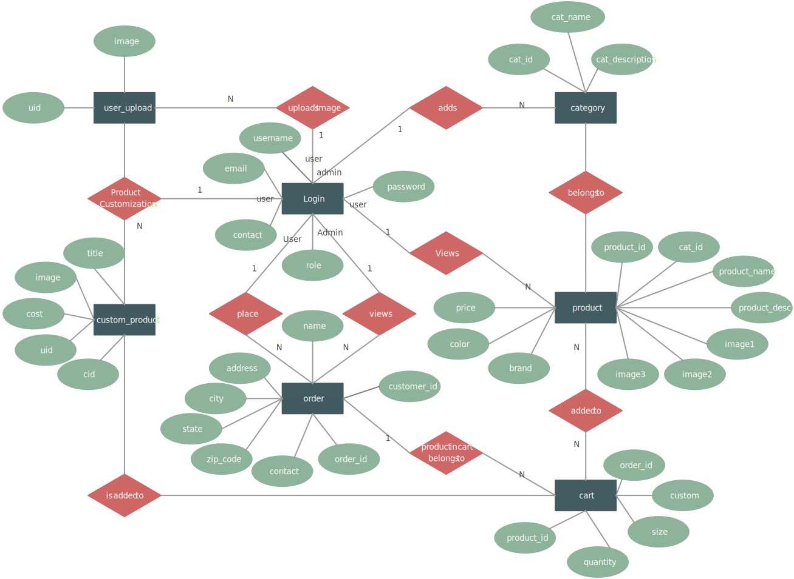

# E-Commerce Project
This project developped according to lecture (ECC431 E-Commerce) requirements. A technical elective lecture given by [MSc. Buğra Demircioğlu](https://ziraat.neu.edu.tr/akademik-personel/bugra-demircioglu/).

## Diagrams for E-Commerce Project
This is the concept diagram if we want to move the project to AWS.

## Pages (Will be developped)

- Register and Login: user authentication.
- Home: list of products and user information.
- Detail: detail of product.
- Basket: purchased products. 

## Run the project (Will be updated while development)

- poetry shell
- poetry install ( i assume u have installed poetry )
- python manage.py

## Used Techs (Will be updated while development)
- python 3.10.6
- fastapi
- mysql
- docker & docker-compose
- celery
- poetry
